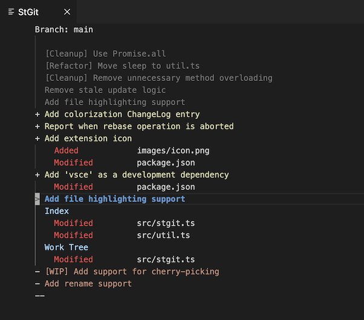

# StGit VSCode Support

The main purpose of this extension is making it easy to modify, amend, reorder, squash or split commits during development with VSCode.

This extension provides a frontend to StGit, which is an external command line tool for managing patch series in the form of Git commits. Refer to the [StGit homepage](https://stacked-git.github.io/) for more details about StGit.

The functionality of this extension is heavily inspired by a corresponding Emacs mode for StGit, originally written by David Kågedal.

## Features

The StGit patch series is displayed in a window. StGit and Git operations, bound to various keyboard shortcuts, allow the series to be reworked
as desired.

The extension also provides an Emacs-like diff mode, which among other things allows individual hunks to be applied, staged or split into smaller hunks.

> Hint: To enter StGit, press `Ctrl-C Ctrl-I` or run the "`StGit: Open...`"
command. In the `StGit` window, press `h` to list all available StGit
operations.

## Requirements

This extension requires StGit to be installed (the executable is called `stg`). The tool is available in most distributions (e.g. through "`brew install stgit`" on macOS). It can also be downloaded from GitHub [here](https://stacked-git.github.io).

<!--
## Extension Settings

This extension contributes the following settings:

* `myExtension.enable`: enable/disable this extension
* `myExtension.thing`: set to `blah` to do something
-->

## Known Issues

The tool is currently configured for "hardcore" users. I.e. no warnings
before deleting patches etc (StGit comes with functionality to undo most
operations though).

The StGit extension can be used together with the popular Vim mode for VsCode, but there are currently a few key mapping conflicts for the StGit editor.

## Release Notes

The latest release notes are available
[here](https://github.com/srydh/vscode-stgit/blob/main/CHANGELOG.md).
